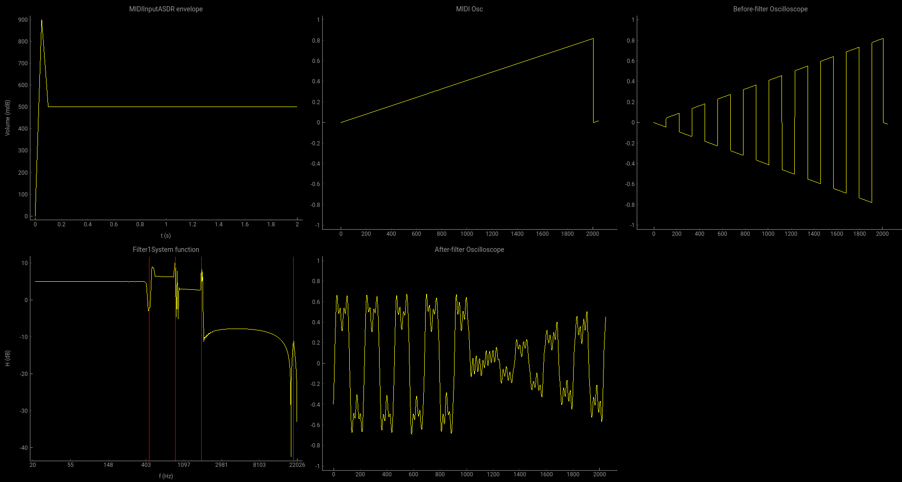
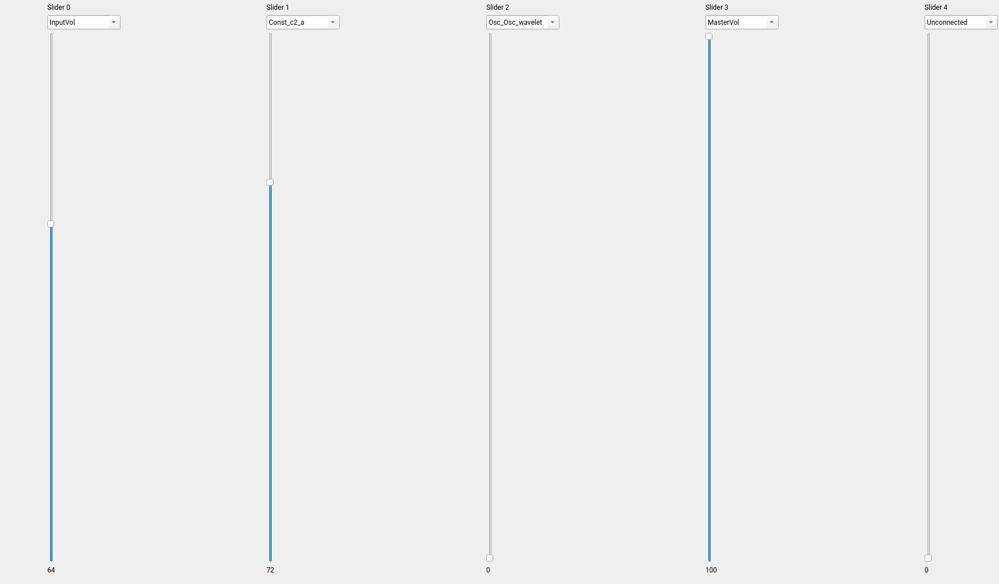
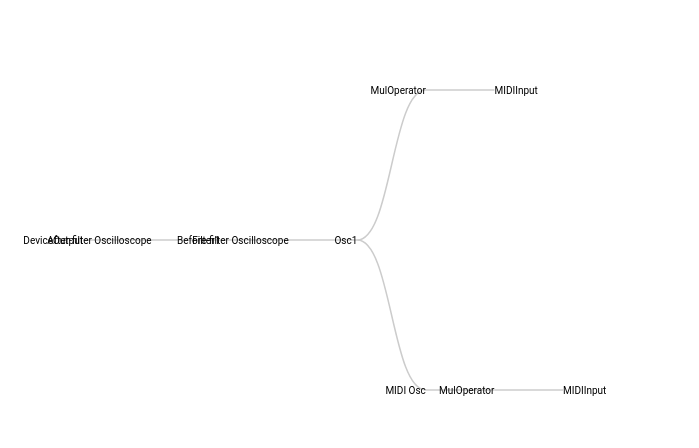

# fm-synth
Image-Line Sytrus-like FM Synthesizer Implementation in Python.

## Features

##### Programmable Digital Synthesizer

- Declaritive syntax for your operator design

```python
midi = MIDIInput(gui=gui, sr=sr, buffer_size=buffer_size, bpm=45)

mux = MuxOperator(input_ops=[midi], output_count=2)

c1_f = ConstOperator(constant=0.5, sr=sr, buffer_size=buffer_size, name='c1_f')
c2_a = ConstOperator(constant=1, sr=sr, buffer_size=buffer_size, name='c2_a')
sine = Oscillator(input_ops=[c1_f, c2_a], in_conn=((0, 0), (1, 0)), osc_type='sine')

mul = MulOperator(input_ops=[c2_a, mux])

osc100 = Oscilloscope(gui=gui, input_ops=[mul], connections=((0, 0),), name='MIDI Osc')
osc1 = Oscillator(input_ops=[mux, osc100],
                 in_conn=((0, 0), (1, 0)),
                 volume=1,
                 osc_type='square',
                 name='Osc1')

mux.swap_outputs((1, 0))
raw_osc = Oscilloscope(input_ops=[osc1], gui=gui, name='Before-filter Oscilloscope')
filtered = FIRFilter(input_ops=[raw_osc],
                     bands=[(440, 0.7), (440, 880, 1), (880, 1760, 0.9), (1760, 20000, 1)],
                     # window_func=functools.partial(np.kaiser, beta=100),
                     window_func=np.hamming,
                     filter_size=2048,
                     gui=gui,
                     name='Filter1')
osc = Oscilloscope(input_ops=[filtered], gui=gui, name='After-filter Oscilloscope')
out = DeviceOutput(input_op=osc, volume=1)

```

##### Visualization

- Oscilloscopes



- Map any parameters to any gliders



- Visualization of operator connections




##### Cross Platform

We use Python, JACK for sound playback, PyQt for GUI and WebEngine/JavaScript for visualization and they are all available on main platforms(Linux, Windows, MacOS).

### TODOs

#### 功能性TODOs

- Oscillator
    - Done. 单周期波形更多样化. \[Unimportant 手动绘制, 或者给函数表达式 ?\]
    - Done. 实现 ADSR, attack-decay-sustain-release,
        - Done. 所有的 Operator 需要添加调幅输入(现在只有 Oscillator 支持调幅)
        - Done. 如何得知一个按键按下(不需要了, 现在所有 Osc 有调幅和调频两个输入)
    
    - 支持左右声道(PAN).

- Filter
    - 换用 IIR 滤波器, 提升性能 
    - 支持 Sytrus 的滤波器那样既可以调节通带频率, 又可以调节衰减的 Filter


#### 易用性TODOs

1. Done. 用 pyqt 搭起 GUI 框架, 把现有的 Oscilloscope 放进去, Operator 的参数用滑动条调节

2. Done. 支持滑动条的 Channel, 每个 Operator 可以在全局注册一个名字唯一的 Channel, 一个滑动条可以通过选择 Channel 来选择该
    滑动条控制哪个 Operator 的参数.

#### 模型

1. 用 JSON 或者 YAML 来描述 Operator 之间的连接关系

#### 工程性 TODOs

- Documentation
    - Add API documentation for users.
    - Add operators documentation for developers.
    - Add available features list.
    - Milestones.
- Add some example images for demonstration usage.
- Add IDE related configs, e.g. VSCode 
- Upgrade dependent libraries to the latest version.

#### Known Bugs

1. QWebEngine Operator 依赖图的部分文字大小不正确，被覆盖了。
